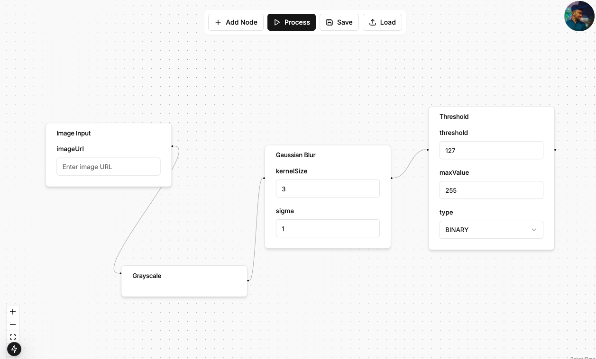

# BuildCV | Building cv algorithms 100x faster

> A node interface editor for building opencv algorithm

###  Benefits for Developers
1. Ease of Use

    - The visual interface eliminates the need for writing boilerplate code.

    - Drag-and-drop functionality simplifies workflow creation.

2. Customization

    - Adjustable parameters like kernel size, sigma, and thresholds allow fine-tuning of image processing tasks.

3. Real-Time Feedback

    - Instant previews enable iterative adjustments and debugging.

4. Efficiency

    - Modular design and streamlined workflows save time and enhance productivity.

